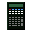
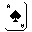
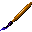
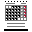
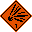
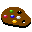
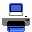
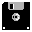
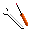

# My Pixel-Art Icons
Small set of totally free and royalty free pixel art icons. 
## Overview
If you want them (you can find more pretty icons here) feel free to simply take them and use in your programs - credits are not necessary.
## Examples
Here are examples of few icons from this set:

