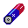
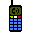
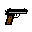
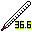
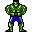
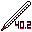
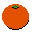
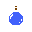
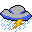

#  Pixel-Art Icons
Still growing set of totally free and royalty free pixel art icons. 

## Overview
Set of roughly 250 of my hand-drawn icons. If you want them (you can find more pretty icons here) feel free to simply take them and use in your programs - credits are not necessary. __Latest version for download is [*here*](https://github.com/tstamborski/pixelart-icons/releases/download/v2025.03/pixelart-icons-2025-03.zip).__ Or you can simply clone this repo.

## Examples
Here are examples of a few icons from this set:

